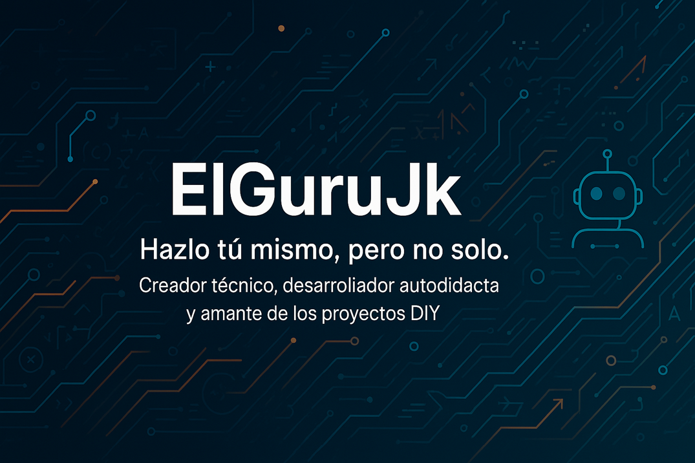

# 👋 ¡Hola! Soy Juank – @ElGuruJk

💡 Creador técnico, desarrollador autodidacta y amante de los proyectos DIY.  
🔧 Automatizo, optimizo y enseño tecnología útil con un enfoque humano.

---

## 🚀 ¿Qué hago?

- Desarrollo herramientas y scripts para optimizar sistemas
- Automatizo procesos usando hardware como ESP32 y Raspberry Pi
- Comparto proyectos educativos para makers y autodidactas
- Estoy aprendiendo IA para integrarla en soluciones reales

---

## 📦 Proyectos destacados

- [TunningWinPro GUI](https://github.com/ElGuruJk/TunningWinPro_GUI): Herramienta para optimización de Windows
- [Curso Maker Domótica Básica](#): En desarrollo, 100% práctico
- [Explorador de Caracteres Unicode](#): Visualizador de símbolos para desarrolladores

---

## 📚 Estoy aprendiendo

`C#` `Python` `MVVM` `ESP32` `Power BI` `GitHub Actions` `IA aplicada`

---

## 🤝 Colaboremos

¿Tienes una idea o proyecto en mente? ¿Te gustaría aprender juntos?  
📩 Contáctame vía [LinkedIn](https://linkedin.com/in/elgurujk) o sígueme en YouTube.

> **Hazlo tú mismo, pero no solo.**
